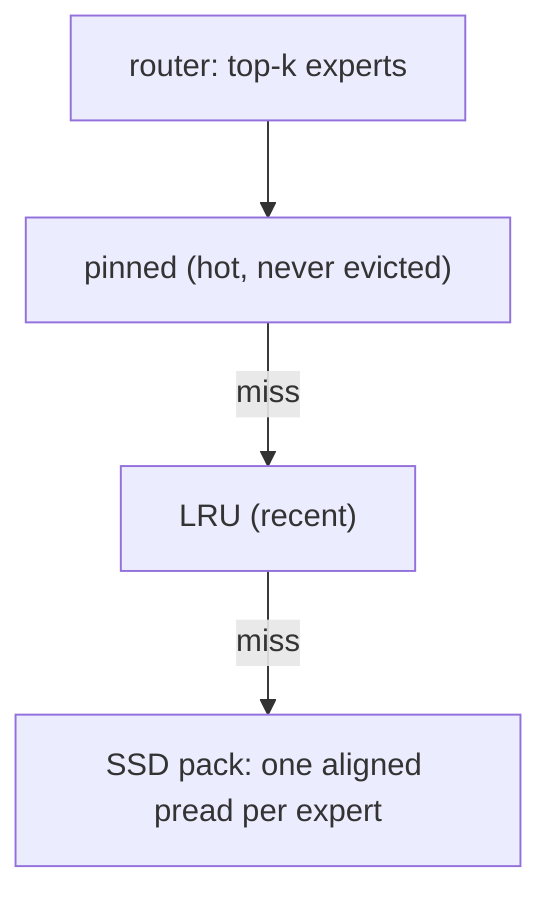

# A 235B-parameter model on a laptop: tiering MoE experts across unified memory and SSD

*2026-09-28 · B A NaveenKumar*

> **Summary.** Qwen3-235B-A22B uses only 22B of its 235B parameters for each token. Hale-Token
> is a Rust engine that takes this literally on Apple Silicon: the hottest experts stay
> pinned in unified memory, recent ones sit in an LRU, and the rest stream from the SSD in a
> page-aligned pack. A cost model tells you what your Mac can run before you download 100+ GB.
> Logits match `transformers`, SSD streaming is bit-identical to RAM, and the first
> real measurement found a textbook LRU pathology.

## Idle weights

In a mixture-of-experts model, each layer's router picks a handful of experts (top-8 of 128
for Qwen3-235B) per token. Most of the model does nothing on most tokens, but the usual way to
run it is to load all of it. At bf16 that's 470 GB.

On a Mac there is no GPU VRAM to fill, because CPU and GPU share one pool of unified memory.
The only slow boundary left is **RAM ↔ SSD**. Apple's NVMe drives read at 3–7 GB/s, which is
slow compared to 68–819 GB/s of memory bandwidth but fast enough to fetch the few experts a
token needs that aren't already in RAM.



## Three pieces that make it work

**1. An expert pack built for SSDs.** `hale convert` quantizes every expert (q4_0 is 3.5×
smaller than bf16) and writes them as fixed-size, 16 KiB-aligned records with gate, up and
down contiguous. Finding expert *e* of layer *ℓ* is `base + (ℓ·E + e)·stride`: no index,
one `pread` per miss, and `F_NOCACHE` so macOS doesn't keep a second copy.

**2. Concurrent misses outside locks.** When a layer needs 8 experts and 3 are missing, all
3 reads go out at once to keep the NVMe queue full, and neither cache lock is held while
they're in flight.

**3. A planner you can run before downloading.** From the chip's bandwidth, core counts,
RAM and SSD speed:

```
t_token = max(t_memory, t_compute) + t_ssd
```

SSD time is *added* rather than overlapped, because a layer can't start without its experts.
`hale plan --compare` prints this for every preset model on a range of Macs. For
Qwen3-235B-A22B at q4_0, the estimate is 0.7 tok/s on a 64 GB M4 Pro and 14.1 tok/s on a
512 GB M3 Ultra. These are floors that assume uniform routing, and real routers are skewed.

## The bug the first measurement found

The first placement policy was simple: whatever doesn't fit goes into an LRU. On CI (an M1
VM), TinyMixtral with a cache of 25% of its experts gave a **0% hit rate** and read 11.9 GB
from the SSD in 32 tokens.

The reason is a classic. Each token walks the layers in the same order, so expert accesses
are **cyclic**, and an LRU smaller than the cycle evicts every expert just before it's needed
again. Replacing the LRU with a **pinned** set of the same size gave an 18% hit rate (close to
the 25% you'd expect from uniform routing) and cut reads to 9.7 GB. The planner now pins
everything whenever the budget is smaller than two tokens' working set.

## Correctness first

- Logits at **every position** match an independent float64 NumPy implementation on tiny
  Mixtral and Qwen3-MoE fixtures.
- Streaming experts through a one-expert cache gives **bit-identical** logits to keeping
  them all in RAM.
- On the real TinyMixtral-4x248M-MoE, logits match Hugging Face `transformers` to a relative
  RMS error of 1.2e-6 (bf16) and 0.42% (q8_0 experts), with 100% top-1 agreement.
  Greedy output: "**Paris.** …".

On the shared M1 CI VM, decode runs at 26–34 tok/s with experts resident and 10.3–11.5
tok/s with 75% of experts on SSD. That VM measures only 7–10 GB/s of memory bandwidth
(a physical M1 does 68), so treat these as lower bounds.

## Next

A Metal backend, batched prefill, and MLA plus shared experts so that DeepSeek-V3 and
Kimi-K2 go from "plannable" to "runnable". Then physical-hardware numbers for Qwen3-30B-A3B
and Qwen3-235B-A22B.

Code, paper and diagrams:
[github.com/basaanithanaveenkumar/Hale-Token](https://github.com/basaanithanaveenkumar/Hale-Token).
