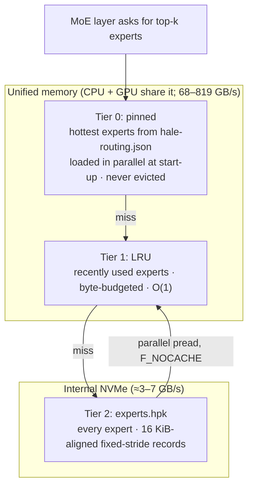
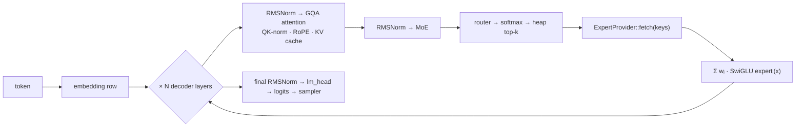
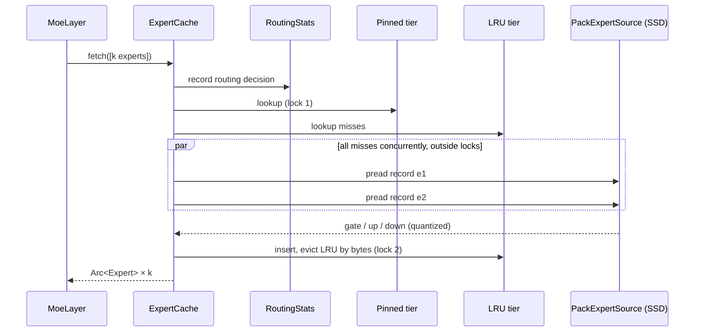
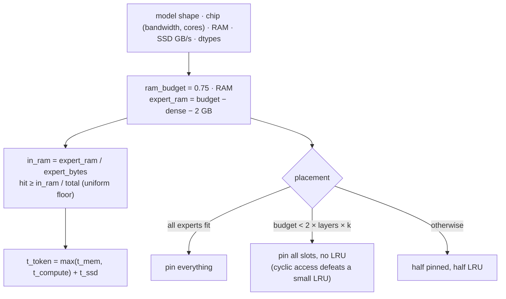
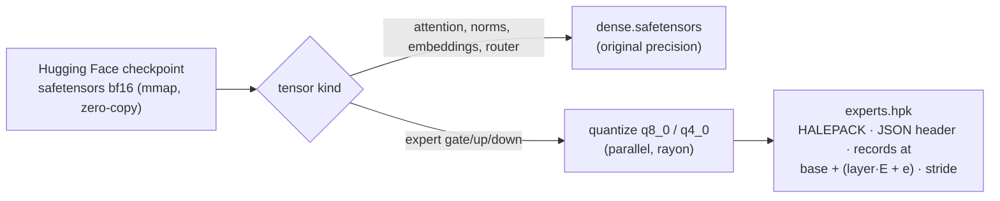
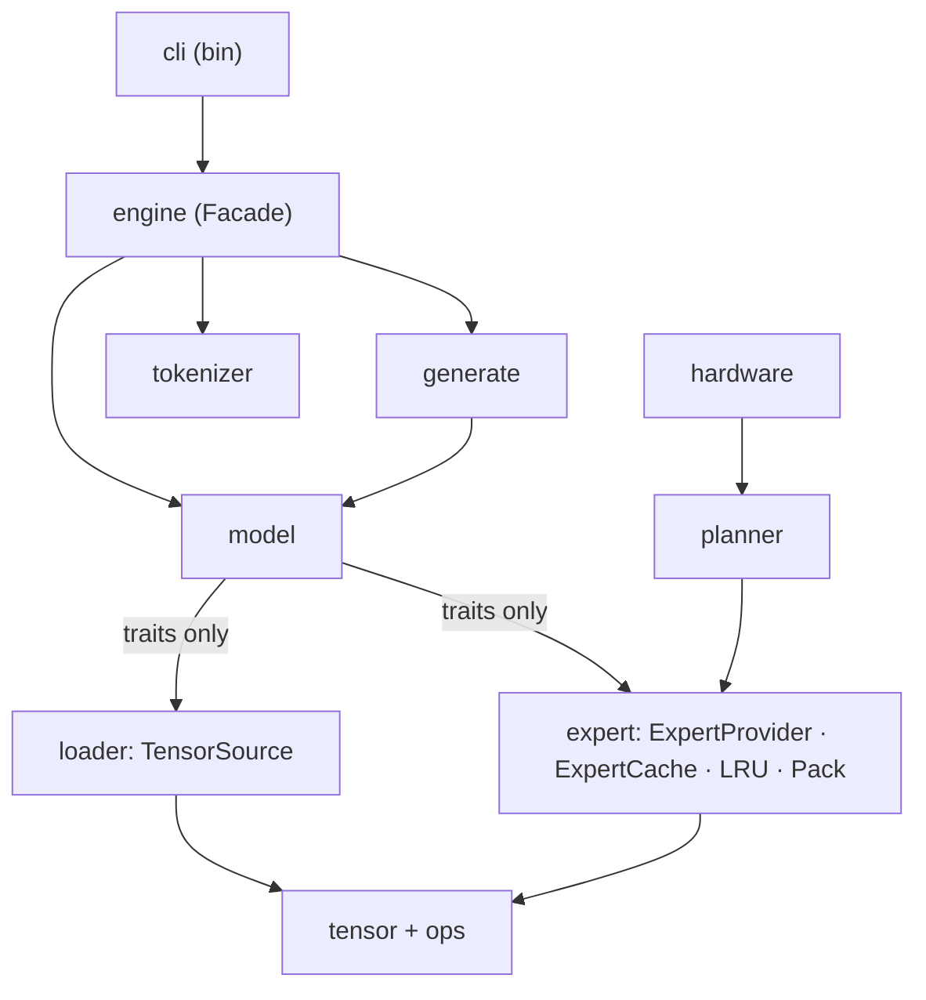

# Diagrams

Mermaid versions of the architecture (they render on GitHub). The prose explanations
are in [architecture.md](architecture.md) and [memory-tiering.md](memory-tiering.md).
These figures also appear on the [project page](../project-page/index.html) and in the
[paper](../paper/main.tex).

## 1. Three memory tiers

## 2. One token, end to end

## 3. Cache lookup (`ExpertCache::fetch`)

## 4. Planner (cost model and placement)

## 5. Conversion

## 6. Module dependencies

